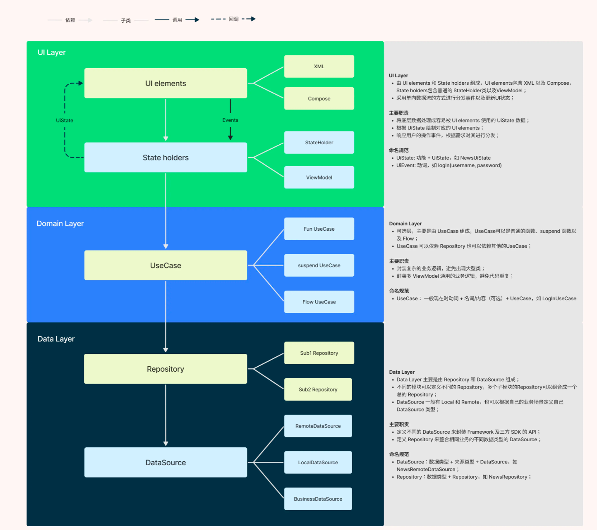
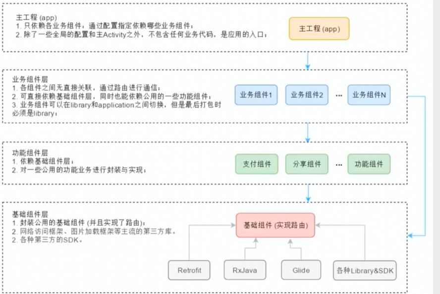

# 目录结构

项目使用技术：kotlin+jectpack(compose、hilt)+mvi\mvp\mvvm+组件化项目，内部包含了各种方式封装的网络请求，架构模式以及一些常用的功能点。


```
.
├── README.md
├── app
│   ├── build.gradle
│   ├── proguard-rules.pro
│   └── src
│       └── main
│           ├── AndroidManifest.xml
│           └── java
│               └── com
│                   └── fs
│                       └── jectpack
│                           ├── APP.kt
│                           └── MainActivity.kt
├── build.gradle
├── modulesBase
│   ├── libBase
│   │   └── src
│   │       └── main
│   │           ├── AndroidManifest.xml
│   │           └── java
│   │               └── com
│   │                   └── fs
│   │                       └── libbase
│   │                           ├── BaseApplication.kt
│   │                           ├── mvcbase
│   │                           │   └── BaseComposeActivity.kt
│   │                           ├── mvibase
│   │                           │   ├── Action.kt
│   │                           │   ├── State.kt
│   │                           │   └── Store.kt
│   │                           ├── mvpbase
│   │                           │   ├── BaseMVPActivity.kt
│   │                           │   ├── BasePresenter.kt
│   │                           │   └── BaseView.kt
│   │                           ├── mvvmbase
│   │                           │   ├── BaseActivity.kt
│   │                           │   └── BaseViewModel.kt
│   │                           └── netbase
│   │                               ├── BaseRepository.kt
│   │                               ├── BaseUseCase.kt
│   │                               ├── CommonResponse.kt
│   │                               ├── DataResult.kt
│   │                               └── ErrorBean.kt
│   ├── libNet
│   │   └── src
│   │       └── main
│   │           ├── AndroidManifest.xml
│   │           └── java
│   │               └── com
│   │                   └── fs
│   │                       └── libnet
│   │                           ├── BaseHttpClient.kt
│   │                           ├── FsCookie.kt
│   │                           ├── HttpClient.kt
│   │                           ├── IApiEnvironment.kt
│   │                           ├── ResponseCodeHandler.kt
│   │                           └── net
│   │                               ├── HttpCallBack.kt
│   │                               ├── HttpModule.kt
│   │                               ├── ICallBack.kt
│   │                               ├── IHttpProcessor.kt
│   │                               └── OtherProcessor.kt
│   └── libUtils
│       └── src
│           └── main
│               ├── AndroidManifest.xml
│               └── java
│                   └── com
│                       └── fs
│                           └── libutils
│                               ├── cache
│                               │   ├── BaseCache.kt
│                               │   ├── FsCache.kt
│                               │   ├── ICacheFunction.kt
│                               │   └── MMKVCache.kt
│                               ├── constants
│                               │   ├── Constant.kt
│                               │   └── RoutConstant.kt
│                               └── utils
│                                   └── CommonUtils.kt
├── modulesCore
│   ├── category
│   │   └── src
│   │       └── main
│   │           ├── AndroidManifest.xml
│   │           ├── debug
│   │           │   └── AndroidManifest.xml
│   │           └── java
│   │               └── com
│   │                   └── fs
│   │                       └── module
│   │                           └── category
│   │                               ├── CategoryApiService.kt
│   │                               ├── compose
│   │                               ├── login
│   │                               ├── permission
│   │                               ├── product
│   │                               └── ui
│   └── home
│       ├── build.gradle
│       └── src
│           └── main
│               ├── AndroidManifest.xml
│               ├── assets
│               │   └── country.json
│               ├── debug
│               │   └── AndroidManifest.xml
│               └── java
│                   └── com
│                       └── fs
│                           └── module
│                               └── home
│                                   ├── HomeActivity.kt
│                                   ├── HomeApiService.kt
│                                   ├── country
│                                   ├── module
│                                   └── mvpdemo
├── modulesPublic
│   └── modulePay
│       └── src
│           └── main
│               ├── AndroidManifest.xml
│               └── java
│                   └── com
│                       └── fs
│                           └── modulepay
├── settings.gradle
└── tree.txt
```

## 目录结构介绍


```
.
├── app
│   └── src
│       └── main
├── gradle.properties
├── gradlew
├── gradlew.bat
├── local.properties
├── modulesBase
│   ├── libBase
│   │   └── src
│   ├── libNet
│   │   └── src
│   └── libUtils
│       └── src
├── modulesCore
│   ├── category  分类模块
│   │   ├── sampledata
│   │   └── src
│   └── home   首页模块
│       └── src
├── modulesPublic
│   └── modulePay
│       └── src
├── settings.gradle
└── tree.txt
```
项目采用组件化搭建


app --- > 壳工程


modulesCore ---> 业务层组件，比如：首页、分类、我的


modulesPublic ---> 公共业务逻辑，比如：支付  分享


modulesBase ---> 基础组件，主要封装一些base和工具，比如：网络请求、工具类、base类、图片框架、各种第三方SDK




## 依赖关系
  app  依赖 modulesCore  依赖  modulesPublic 依赖 modulesBase
  
## 组件化开关
  项目jectpack的build.gradle下
  isDebug = false //调试和正式模式切换

  设置为true后，业务层组件可以单独运行

# 项目细节介绍
  项目中添加多个demo来展示我们平时使用的架构以及工具
  ```
  │   └── libUtils
│       └── src
│           └── main
│               ├── AndroidManifest.xml
│               └── java
│                   └── com
│                       └── fs
│                           └── libutils
│                               ├── cache
│                               │   ├── BaseCache.kt
│                               │   ├── FsCache.kt
│                               │   ├── ICacheFunction.kt
│                               │   └── MMKVCache.kt
│                               ├── constants
│                               │   ├── Constant.kt
│                               │   └── RoutConstant.kt
│                               └── utils
│                                   └── CommonUtils.kt
  
  ```
  libUtils:最底层的工具

  cache:存储工具，使用腾讯的MMKV架构，通过代理模式，封装成了FsCache

  constants:常量包，里面包含各种常量

```
│   ├── libNet
│   │   └── src
│   │       └── main
│   │           ├── AndroidManifest.xml
│   │           └── java
│   │               └── com
│   │                   └── fs
│   │                       └── libnet
│   │                           ├── BaseHttpClient.kt
│   │                           ├── FsCookie.kt
│   │                           ├── HttpClient.kt
│   │                           ├── IApiEnvironment.kt
│   │                           ├── ResponseCodeHandler.kt
│   │                           └── net
│   │                               ├── HttpCallBack.kt
│   │                               ├── HttpModule.kt
│   │                               ├── ICallBack.kt
│   │                               ├── IHttpProcessor.kt
│   │                               └── OtherProcessor.kt

```

  libNet:封装了网络请求框架

  libnet:使用Retrofit+携程 封装的网络请求

  FsCookie:持久化cookie，保持持久登录

  net:使用代理模式，封装了网络请求，使用方式见HomeActivity

```
│   ├── libBase
│   │   └── src
│   │       └── main
│   │           ├── AndroidManifest.xml
│   │           └── java
│   │               └── com
│   │                   └── fs
│   │                       └── libbase
│   │                           ├── BaseApplication.kt
│   │                           ├── mvcbase
│   │                           │   └── BaseComposeActivity.kt
│   │                           ├── mvibase
│   │                           │   ├── Action.kt
│   │                           │   ├── State.kt
│   │                           │   └── Store.kt
│   │                           ├── mvpbase
│   │                           │   ├── BaseMVPActivity.kt
│   │                           │   ├── BasePresenter.kt
│   │                           │   └── BaseView.kt
│   │                           ├── mvvmbase
│   │                           │   ├── BaseActivity.kt
│   │                           │   └── BaseViewModel.kt
│   │                           └── netbase
│   │                               ├── BaseRepository.kt
│   │                               ├── BaseUseCase.kt
│   │                               ├── CommonResponse.kt
│   │                               ├── DataResult.kt
│   │                               └── ErrorBean.kt
```
  libBase:封装base类

  mvcbase:mvc架构下的base

  mvibase:mvi架构下的base,主要对action和state做封装

  mvpbase:MVP架构下的base

  mvvmbase:MVVM架构下的base

  netbase:网络请求回来数据的封装，包括返回的数据，错误信息等

## 启动优化
一、设计启动框架

    androidStartUp
   
二、优化用户体验
    任务写到哪些位置

三、启动优化必须完成的七件事


   1、黑白屏问题--->图片/动画处理
      单个方法执行时间查看方式--->profile app 可以查看单个方法执行时间


   2、布局优化
      setCountView ---> 减少viewGroup的嵌套，避免多次填充布局导致内存ANR


   3、尽量不要在application 和 欢迎界面的onCreate方法里面写代码


   4、在 onWindowFocusChanged 这个方法里面完成欢迎页面的初始化，这里面代码执行，不会影响ui


   5、使用启动框架+懒加载+预加载
      懒加载-->网络请求初始化、数据库初始化 都可以在使用的时候再去加载
      预加载-->先加载本地数据，在此同时，加载网络数据。


   6、部分初始化需要放到contentProvider中处理：appStartUp


   7、代码质量的问题---->阿里开发规范

## 卡顿优化

   
      
